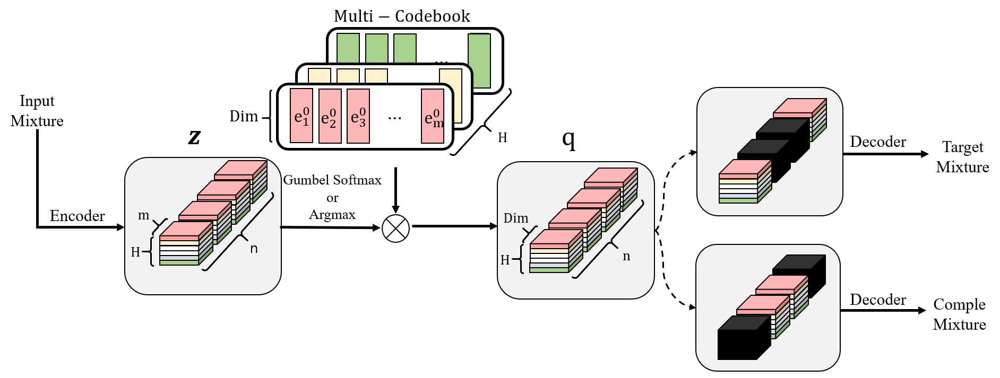
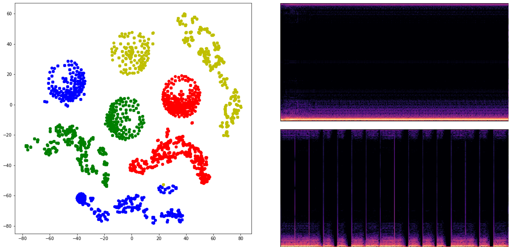

# Abstract

Since music comprises distinctive individual sources (e.g., vocal, instrumental sounds), there is an infinite latent vector to represent music.
Recent year the neural network based method can generate the music representation into a vector easily but it is not readable to human perception to analyze and manipulate.
To address this issue, we propose a novel method to learn a source aware latent representation of music through Vector-Quantized Variational Auto-Encoder(VQ-VAE).
We train our VQ-VAE to encode an input mixture into a tensor of integers in a discrete latent space.
We designed the discrete latent space to have a decomposed structure which allows us to manipulate the encoded latent vector adaptive to human perception.
We claim that it can be adopted for various applications.
To verify this idea, we show that we can generate bass lines by estimating the sequential distribution of our model.

# Introduction
Music is a protean art, combining distinctive individual sources (e.g., vocal, instrumental sounds) in such a way to produce a creative single audio signal.
Humans have a unique auditory cortex, allowing proficiency at hearing sounds, and sensitiveness in frequencies.
For this reason, humans can differentiate individual sources by capturing the unique acoustic characteristics (e.g., timbre and tessitura) of them, even though what they hear is a mixture of sources.
Moreover, experts or highly skilled composers are able to produce sheet music for different instruments.
Meanwhile, trained orchestras or band can reproduce the original music by playing the transcribed scores.
However, if the unskilled transcriber who writes the sheet music lacks the ability to distinguish between different music sources, no matter how good the performers are, they cannot recreate the original music.
This procedure resembles the encoder-decoder concept, widely used in the machine learning field; a transcriber is an encoder, and an orchestra/band is a decoder.
Motivated by this analogy, this paper proposes a method that aims to learn source-aware decomposed audio representations for the given music.
To the best of our knowledge, numerous methods have been proposed for audio representation, yet no existing works have learned decomposed music representations.

# Related work

For Automatic Speech Recognition, [@baevski2020wav2vec,@sadhu2021wav2vec] are proposed using Transformer [@vaswani2017attention]-based models to predict quantized latent vectors.
From this approach, they trained their models to understand linguistic information in human utterance.
[@ericsson2020adversarial,@mun2020sound] learn voice style representations for human voice information.
They applied learned representations for speech separation and its enhancement.
Several studies have applied contrastive learning, used in representation learning@[niizumi2021byol, @wang2021multi] for computer vision.

However, the goal of this paper is different from the above audio representation researches.
We aim to learn decomposed representations through instruments' categories.
In this work, we train a model through source separation for learning decomposed representations.
In section "Experiment" , we show that we can easily manipulate latent representations for various applications such as source separation and music synthesis.
Source Separation tasks have been studied both in music source separation and on speech enhancement tasks.
Within the generating perspective, they can be categorized into two groups.
The first group attempts to generate masks multiplying with the input audio through this preserving target source [@chien2017variational, @jansson2017orcid].
The second group aims to directly estimate a raw audio or spectrogram [@kameoka2019supervised, @9053513, @choi2020lasaft].
We adopt the latter method to obtain more various applicable tasks.
It can generate audio samples directly when we have a prior distribution of representation.
Many studies have proposed methods based on Variational Auto-Encoder (VAE)[@kameoka2019supervised] or U-Net [@choi2020lasaft, @9053513, @yuan2019skip] for source separation.
The U-Net-based models usually show high performance in the source separation task.
However, some studies have pointed out the fundamental limitation of U-Nets; the skip connections used in U-Nets may lead to weakening the expressive power of encoded representations [@yuan2019skip].
Therefore, we choose a VAE-based model to extract meaningful representation from the input audio.

# Proposed Methods

When given an mixture audio, we aim to learn quantized representations, which can be decomposed into $n$ vectors, where $n$ denotes the number of sources.
For the given source set $S=\{s_i\}_{i=1}^n $ and condition vector $C = (c_0, c_1, ..., c_n )$ where $s_i \in S$ is a sources generated by $i^{th}$ source and $c_i\in \{0,1\}$ is a binary mask that determines whether each source is entered into the mixture, and we formulate the mixture audio $\mathcal{M}(S,C)$ as follows:
$$ \mathcal{M}(S,C) = \sum_{i}^{n} c_i \cdot s_i$$

In following section, we describe the method to learn decomposed latent representations.
Figure 1 describes the flow of the proposed model.

{width=60%}

## Latent Quantization
We quantize latent vectors by adopting the vector quantization method proposed in [@oord2017neural].
In addition, we use Gumbel softmax estimation [@jang2016categorical] instead of straight-through estimation, used in the original VQ-VAE [@oord2017neural].
$$ y_{s,i} = \frac{\exp((z_{s,i} + g_i ) / \tau ) }{\sum^{k}_{j=1}\exp((z_{s,j} + g_j)/\tau) }$$
while $\tau$ is a non-negative temperature, $g$ are categorical distribution from $n= -log(-log(u))$, and $u$ are uniform samples from uniform distribution $\mathcal{U}(0,1)$.

During training, Gumbel softmax estimation stochastically maps the representation of the encoder output to discrete latent in the codebook.
For this reason, features in the encoder are selected stochastically rather than deterministically in the codebook.
To do this we can simply implement the reparameterization trick which approximates the categorical distributions and is easier to compute the gradients.
However, during the inference, we deterministically choose one discrete latent in the codebook depend on the encoder output to generate discrete latent representation.

$$ q_s =\begin{cases}
	e^T \otimes y_s &\quad \text{if train step} \\
	e_{i} 					   &\quad \text{if inference step}
\end{cases}$$
where $q$ is quantized representation, $e$ is discrete latent in codebook, $y$ is the output of encoder, and $i=\operatorname{argmax}(z_s)$.

## Multi-latent Quantization
One limitation of the latent quantization approach is the restricted expressiveness.
The expressive power of our model depends on the number of embedding vectors.
While approaches based on continuous latent space can produce infinite numbers of vectors, our model can produce a finite number of latent vectors because ours has a finite set of embedding vectors.

To increase the expressiveness, we increase the number of elements of the finite set.
However, it could raise memory issues.
To resolve this, we construct the representation with the combination of quantized vector $e$ in different codebooks.
$$ q_i=[e^{(1)}_{i}, ..., e^{(h)}_{i}] $$
When the number  $H$ that will be combined are given, each source representation $q_{s}^{(h)}$ are expressed quantized latent $e^{(h)}$ in $h$ codebook, where $h \in \{1,2,3,...,H\}$.
In this approach, express power of the source representation $q_s$ increase exponentially with concatentating the quantized latents.

## Task definition
### Selective source reconstruction
When decomposed quantized representation $q$, which encoded from input condition vector $C$ and input mixture $\mathcal{M}(S,C)$, are given, we assume that each representation vector $q_{i}$ can fully represent each $s_i \cdot c_i$
In this vein, if we select some representations $q_{\{i, ...\}}$, they also have to fully represent $\mathcal{M}(S,X)$, where the selective condition ${X}$ is another condition vector.

We apply this \textit{seletive source reconstruction task} to our model, where we aims to minimize the \textit{selective reconstruction loss}
The selective source reconstruction loss, as follows:
$$ \mathcal{L}_{select} = {\| \mathcal{M}(S,X \odot C)  - \hat{\mathcal{M}}(S,X \odot C) \|}_1^1$$ where $\hat{\mathcal{M}}(S,X \odot C)$ is a estimated audio through decoder network from selective condition $X$ and input condition $C$.
Following this method, a decomposed representation is learned through reconstruction the mixture of selected sources.

### Complement source reconstruction task
For a latent condition vector, there exists a latent condition where some are selected and the others are not.
We call unselected ones the complement condition ${X}^c$ of selective condition $X$.
When calculating the gradients through the selective latent reconstruction loss from $X$, there is no gradient to ${X}^c$.
This lack of gradients only train model on $X$, not  ${X}^c$.
To prevent this problem, we train our model with the \textit{complement source reconstruction task}, where we aims to minimize the \textit{complement loss}.
The complement loss $\mathcal{L}_{compl}$ is defined as follows:
$$ \mathcal{L}_{compl} = {\| \mathcal{M}(S,X^c \odot C)  - \hat{\mathcal{M}}(S,X^c \odot C) \|}_1^1$$

### STFT loss
Only applying sample-level reconstruction loss, the model struggles to generate the high frequencies.
To generate natural music, the model needs to be able to generate high-frequency parts.
Therefore, it is necessary to make the model consider the high-frequency information.
To give a frequency constraint to the model without adding any additional layers, we define an STFT loss as follows:
$$\mathcal{L}_{STFT} =
\| \operatorname{STFT}(\mathcal{M}) - \operatorname{STFT}(\hat{\mathcal{M}}) \|_1^1$$
We apply it to both $\mathcal{L}_{select}$ and $\mathcal{L}_{compl}$.

# Experiment
## Dataset
We use the MUSDB18 dataset [@rafii2017musdb18]. It contains 150 tracks and divided into 86 tracks for training, 14 tracks for validation, and 50 tracks for the test set.
In MUSDB18, each track has 44100 sampling rate and has mixtures constitute with four stereo sources(vocal, bass drum, and other instruments).

## Training Setting
We trained models to predict the raw audio, following the selective source condition, from the raw input audio.
The input mixture audio is formed with the random selected sources and this leads to two positive effects.
It is data augmentation and the model that can learn each source's existence in a mixture of audio.
Target selective source is randomly selected from the input mixture's sources.
When computing the STFT loss, We set the number of FFTs to 2048, and hop length to 512.
We trained models using the Adam optimizer [@kingma2014adam] and set the learning rate to 0.0001.

## Results
To validate our method, we visualize the result of decomposed representations using t-SNE [@van2008visualizing].
After training with the MUSDB18 training dataset, we obtained decomposed representations of single-source tracks in the MUSDB18 test dataset.
Then we apply t-SNE to the set of representations as shown in \autoref{fig:tSNE}.
In \autoref{fig:tSNE}, each color means different sources and the dots are the decomposed representations.
It can be examined that the latent vectors from the same sources tend to be clustered even though there is no constraint about the classification.
It indicates that our method has learned source-aware representations.

{ width=60% }

To better understand that the vector quantization method affects to model's performance, we train a VAE and an Auto-Encoder with the same training framework and almost the same structure to produce representations of the same size.
As a result, they reconstruct only the noise sound instead of the mixtures with their representation vectors.
We also conduct an experiment using methods without the STFT and complement loss, introduced in Section "Proposed Methods" to compare the effects of them.
To this end, we first separate sources from mixtures in the  MUSDB18 test dataset using each model.
Then, we measure Source-to-Distortion Ratio (SDR) @[vincent2006performance], following Musdb18 benchmark to evaluate each models.

<table>

|            | vocals |  bass  | drums | other | Avg   |
|:----------:|:------:|:------:|:-----:|:-----:|-------|
|  proposed  |  1.270 |  1.761 | 1.403 | 0.812 | 1.311 |
|  w/o STFT  |  1.546 |  1.026 | 1.480 | 1.069 | 1.280 |
| w/o comple |  0.996 | -0.031 | 1.458 | 0.576 | 0.749 |

</table>

# Conclusion
This paper explores learning decomposed representations for musical signals.
We propose novel training methods (i.e., selective source reconstruction and complementary source reconstruction) and a VQ-VAE-based model.
To validate our approaches, we visualize the latent representation through the t-SNE algorithm and perform two experiments.
The visualized representation shows that the latent representations of sources are decomposed into different spaces.
The bass generation task shows that the decoder can generate bass lines via new prior.
We consider that our model can be used in other music processing tasks.
For example, our model, which represents discrete representations of input audio, can be adopted in music compression tasks.
In addition, the characteristics of the model generating decomposed audio representation for each source is appropriate for the music sheet transcription task.
We plan to design a decoder that can generate high-quality audio. This can be applied to real-world audio in future work. This methodology can generate a decomposed representation of the various sounds of the real world. As a result, it can be implemented to various tasks such as audio generation and audio event detection, and localization.

# Acknowledgements
This research was supported by Basic Science Research Program through the National Research Foundation of Korea(NRF) funded by the Ministry of Education(NRF-2021R1A6A3A03046770).
This work was also supported by the National Research Foundation of Korea(NRF) grant funded by the Korea government(MSIT)(No. NRF-2020R1A2C1012624, NRF-2021R1A2C2011452).

# References
