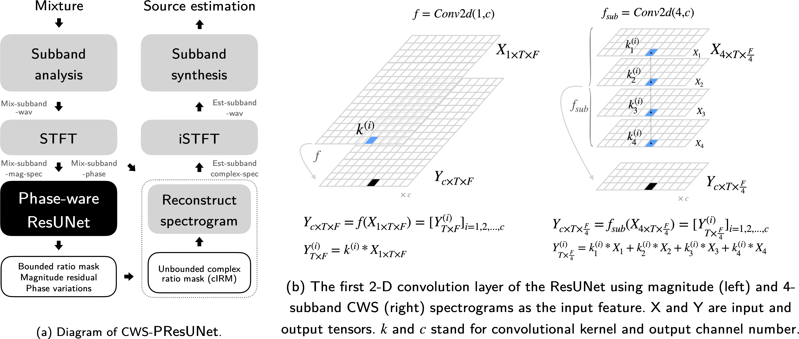

# Abstract

Music source separation (MSS) has shown tremendous success with deep learning models. Many MSS models perform separations on spectrogram by estimating bounded ratio masks and reusing the phase of mixture. If the model is convolutional neural network (CNN) based, weights are usually shared in each channel during convolution, regardless of the dissimilar patterns between frequency bands. In this study, we proposed a new model, channel-wise subband phase-aware ResUNet (CWS-PResUNet), which estimates unbound mask and phase variations in subbands for separations. CWS-PResUNet utilizes channel-wise subband (CWS) feature to limit unnecessary global weight sharing on spectrogram and reduce computational resource consumptions. The resource saved by CWS can in turn allow for a larger architecture. On MUSDB18HQ test set, a 276-layer CWS-PResUNet achieves state-of-the-art performance on *vocals* with a 8.92 SDR score. Based on CWS-PResUNet and Demucs, our system ranks 2nd on *vocals* score and 5th on average score in 2021 ISMIR Music Demixing Challenge limited training data track (leaderboard A).

# Methodology

{ width=100% }

# Experiment Results

|    Models    | Vocals | Drums |  Bass | Other | Average |
|:------------:|:------:|:-----:|:-----:|:-----:|:-------:|
|      UMX     |  6.25  |  6.04 |  5.07 |  4.28 |  5.41   |
|     X-UMX    |  6.61  | 6.47  | 5.43  | 4.64  |  5.79   |
|    Demucs    |  6.89  | **6.57**  | **6.53**  | 5.14  |  6.28   |
| CWS-PResUNet |  **8.92**  | 6.38  | 5.93  | **5.84**  |  6.77   |
|    ByteMSS   |  8.92  | 6.57  | 6.53  | 5.84  |  **6.97**   |

# Discussions

# Reference