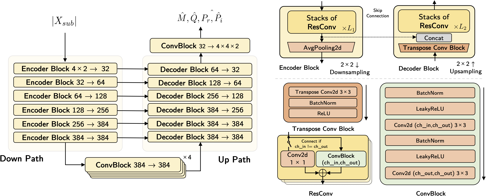
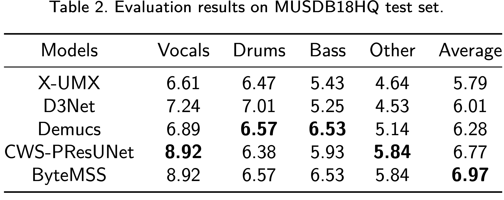

# Abstract  

Music source separation (MSS) shows active progresses with deep learning models in recent years. Many MSS models perform separations on spectrogram by estimating bounded ratio masks and reusing the phases of the mixture. When using convolutional neural networks (CNN), weights are usually shared within spectrogram during convolution regardless of the different patterns between frequency bands. In this study, we propose a new MSS model, channel-wise subband phase-aware ResUNet (CWS-PResUNet), to decompose signals into subbands and estimate the source unbound complex ideal ratio mask (cIRM) for MSS. CWS-PResUNet utilizes channel-wise subband (CWS) feature to limit unnecessary global weights sharing on the spectrogram and reduce computational resource consumptions. The saved computational cost and memory can in turn allow for a larger architecture. On the MUSDB18HQ test set, we proposed a 276-layer CWS-PResUNet and achieve state-of-the-art (SoTA) performance on `vocals` with an 8.92 signal-to-distortion ratio (SDR) score. By combining CWS-PResUNet and Demucs, our ByteMSS system^[https://github.com/haoheliu/2021-ISMIR-MSS-Challenge-CWS-PResUNet] ranks the 2nd on `vocals` score and 5th on average score in the 2021 ISMIR Music Demixing (MDX) Challenge limited training data track (leaderboard A).

# Method

![Overview of our system and a comparison between using magnitude and channel-wise subband spectrogram as the input feature.^[We use mono signal for simple illustration.]](graphs/main.png){ width=100% }

**ByteMSS** is our system submitted for the MDX Challenge [@mitsufuji2021music]. we set up the open-sourced Demucs [@defossez2019demucs] to separate `bass` and `drums` tracks because it perform better than CWS-PResUNet on these two sources. Demucs is a time-domain MSS model. In our study, we adopted the open-sourced pre-trained Demucs^[https://github.com/facebookresearch/demucs] and do not apply the shift trick because it will slow down the inference speed. Also, we utilize a 276-layer CWS-PResUNet to separate the `vocals` track, and a 166-layer CWS-PResUNet for the `other` track. We set the latter with less layers for faster inference speed concern. 

**CWS-PResUNet** is a ResUNet [@zhang2018road;@liu2021voicefixer] based model integrating CWS feature [@liu2020channel] and the cIRM estimation strategies described in @kong2021decoupling. The overall pipeline is summarized in Figure 1a. For a stereo mixture signal $x \in R^{2\times L}$, where $L$ stands for signal length, we first utilize pre-defined analysis filters ${h}^{(j)},j=1,2,3,4$ to perform subband decompositions:
$$
x^{\prime}_{8\times \frac{L}{4}} = [DS_4({x_{2\times L}}*{h}^{(j)}_{2\times 64}]_{j=1,2,3,4},
$$
where $DS_{4}(\cdot)$, $*$, and $[\cdot]$ denote the downsampling by 4, convolution, and stacking operators, respectively. Then we calculate the short-time fourier transform (STFT) of the downsampled subband signals $x^{\prime}$ to obtain their magnitude spectrograms $|X^{\prime}|_{8\times T \times F}$. 

{ width=100% }

As is shown in Figure 2, the phase-aware ResUNet is a symmetric architecture containing a down-sampling and an up-sampling path with skip-connections between the same level. It accepts $|X^{\prime}|$ as input and estimates four tensors with the same shape: mask estimation $\hat{M}$, phase variation $\hat{P}_{r}$, $\hat{P}_{i}$, and direct magnitude prediction $\hat{Q}$. The complex spectrogram can be reconstructed with the following equation:
$$
\hat{S}^{\prime} = \text{relu}(|X^{\prime}|\odot \text{sigmoid}(\hat{M})+\hat{Q})e^{j(\angle X^{\prime} +\angle \hat{\theta})},
$$
in which $cos\angle \hat{\theta}=\hat{P}_{r}/(\sqrt{\hat{P}_{r}^2+\hat{P}_{i}^2})$ and $sin\angle \hat{\theta}=\hat{P}_{i}/(\sqrt{\hat{P}_{r}^2+\hat{P}_{i}^2})$. We pass the mask estimation $\hat{M}$ through a sigmoid function to obtain a mask with values between 0 and 1. Then by estimating $\hat{Q}$ and $\hat{\theta}$, models can calculate the unbounded cIRM and avoid the limited upper bound brought by estimating mask with bounded values and using mixture phase [@kong2021decoupling]. We use relu activation to ensure the positve magnitude value. Finally, after the inverse STFT, we perform subband reconstructions to obtain the source estimation $\hat{s}$:
$$
\hat{s}_{2\times L} = \sum_{j=1}^{4}US_4(\hat{s}^{\prime}_{8\times \frac{L}{4}})*g^{(j)}_{8\times 64},
$$
where $g^{(j)}, j=1,2,3,4$ are the pre-defined synthesis filters and $US_4(\cdot)$ is the zero-insertion upsampling function.

As is illustrated in Figure 1b, the CWS feature can make the CNN feature-maps smaller and save computational resources. Also, models become more efficient by enlarging receptive fields and diverging subband information into different channels. Our model for `vocals` is optimized by calculating L1 loss between $\hat{s}$ and its target source $s$. Despite we also use a model dedicated to separate the `other` track, we notice estimating and optimizing four sources together can result in a 0.2 SDR [@vincent2006performance] gain on `other`. So, we calculate both L1 loss and energy-conservation loss across four sources to optimize the model for `other`. Our CWS-PResUNet models for `bass` and `drums` reported in the next section employ the same setup as the model for `other`.

<!-- Moreover, because bounded mask and mixture phase can limit the theoretical upper bound of the MSS system [@kong2021decoupling], we estimate unbounded mask and phase variations in each subband to compute the unbounded cIRM.  -->

# Experiments

Our models are optimized using the training subset of MUSDB18HQ [@rafii2019musdb18]. We calculate the STFT of the downsampled 11.05 kHz subband signals with a window length of 512 and a window shift of 110. We use Adam optimizer with an initial learning-rate of 0.001 and exponential decay. CWS-PResUNet takes approximately four days to train on a Tesla V100 GPU. During inference, we utilize a 10-second long `boxcar` windowing function [@schuster2008influence] with no overlapping to segment the signal. For evaluation, we report the SDR on the MUSDB18HQ test set with the open-sourced *museval* tool [@SiSEC18]. 

The subband analysis and synthesis operations usually cannot achieve perfect reconstruction. To assess the errors introduced by subband operations, we decompose the test set `vocals` tracks into 2,4 and 8 subbands and reconstruct them back for evaluations. As is presented in Table 1, in all cases subband reconstructions achieve a high performance with only neglectable errors.

<!-- | Subband numbers |   2   |   4  |   8  |
|:---------------:|:-----:|:----:|:----:|
|       SDR       | 102.3 | 93.7 | 79.9 | -->

{ width=100% }

Table 2 lists the results of the baselines and our proposed systems. Our CWS-PResUNets achieve an SDR of 8.92 and 5.84 on `vocals` and `other` sources, respectively, outperforming the baseline X-UMX [@x-umx-sawata2021all], D3Net [@takahashi2020d3net], and Demucs systems by a large margin. Demucs performs better than CWS-PResUNet on `bass` and `drums` tracks. We assume that is because time-domain models can learn better representations than time-frequency features so are more suitable on separating percussive and band-limited sources. The average performance of our ByteMSS system is 6.97, marking a SoTA performance on MSS. Considering the high performance of the `vocals` model, we also attempt to separate three instrumental sources from `mixture` minus `vocals`. In this case, the average score remains 6.97, in which the `drums` score increase to 6.72 but the other three sources drop slightly. In the future we will address the integration of time and frequency models for the compensations in both domains.

{ width=100% }

<!-- |    Models    | Vocals | Drums |  Bass | Other | Average |
|:------------:|:------:|:-----:|:-----:|:-----:|:-------:|
|     X-UMX    |  6.61  |  6.47  | 5.43  | 4.64  |  5.79  |
|     D3Net    |  7.24  |  7.01 |  5.25 |  4.53 |  6.01   |
|    Demucs    |  6.89  | **6.57**  | **6.53**  | 5.14  |  6.28   |
| CWS-PResUNet |  **8.92**  | 6.38  | 5.93  | **5.84**  |  6.77   |
|    ByteMSS   |  8.92  | 6.57  | 6.53  | 5.84  |  **6.97**   | -->

# Acknowledgements

This project is funded by ByteDance Inc. We acknowledge the supports from Haonan Chen for testing our system. 

# Reference