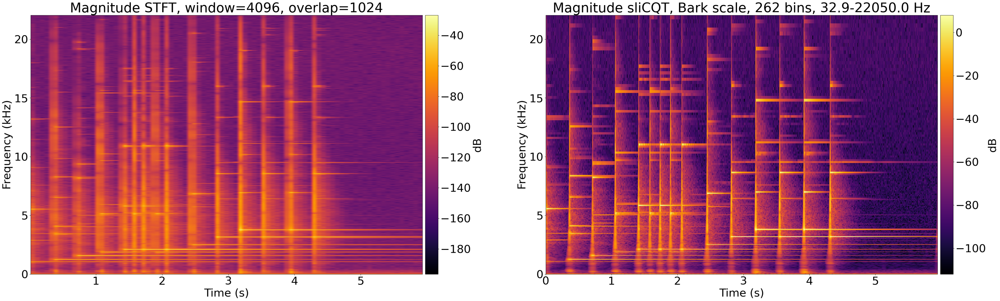

# Abstract

Music source separation, or music demixing, is the task of decomposing a song into its constituent sources, which are typically isolated instruments (e.g., drums, bass, vocals). The ISMIR 2021 Music Demixing Challenge^[<https://www.aicrowd.com/challenges/music-demixing-challenge-ismir-2021>] was launched to inspire new demixing research. Open-Unmix or UMX [@umx], and the improved variant CrossNet-Open-Unmix or X-UMX [@xumx], are near-state-of-the-art models which were included in the challenge as the baselines, and both use the Short-Time Fourier Transform (STFT).

From the time-frequency uncertainty principle [@gabor1946], the STFT of a signal cannot be maximally precise in both time and frequency, and the tradeoff of time-frequency resolution can significantly affect music demixing results [@tftradeoff1]. The proposed adaptation of Open-Unmix replaced the STFT with the sliCQT [@slicq], an STFT-like transform with varying time-frequency resolution designed for music analysis. The result, xumx-sliCQ,^[<https://github.com/sevagh/xumx-sliCQ>] was ~2x slower and ~1 dB worse than Open-Unmix, with a ~5x smaller model.

# Background

The STFT is computed by applying the Discrete Fourier Transform on fixed-size windows of the input signal. From both auditory and musical motivations, variable-size windows are preferred, with long windows in low frequency regions to capture detailed harmonic information with a high frequency resolution, and short windows in high frequency regions to capture transients with a high time resolution [@doerflerphd]. The sliCQ Transform [sliCQT\; @slicq] is a realtime implementation of the Nonstationary Gabor Transform [NSGT\; @balazs], a time-frequency transform with complex Fourier coefficients and perfect inverse using time-varying windows. An important application of the NSGT or sliCQT is to create an invertible implementation of the Constant-Q Transform [CQT\; @jbrown].

# Methodology

In music demixing, the oracle estimator represents the theoretical upper limit of performance of a given strategy using ground truth signals. In Open-Unmix, the phase of the STFT is discarded, and the estimated magnitude STFT of the target is combined with the phase of the mix to get the first estimate of the waveform. This is sometimes referred to as the "noisy phase" [@noisyphase1; @noisyphase2], described by \autoref{eq:noisyphaseoracle}.
\begin{equation}\label{eq:noisyphaseoracle}
\hat{X}_{\text{target}}(j\omega) = |X_{\text{target}}(j\omega)| \cdot \measuredangle{X_{\text{mix}}(j\omega)}, \hat{x}_{\text{target}}[n] = \text{iSTFT}(\hat{X}_{\text{target}}(j\omega))\\
\end{equation}

{ width=100% }

The STFT outputs a single time-frequency matrix where all of the frequency bins have a uniform time resolution. The sliCQT by contrast outputs a ragged list of time-frequency matrices, where each matrix contains frequencies grouped by their common time resolution. In xumx-sliCQ, convolutional layers adapted from an STFT-based vocal separation model [@plumbley2] were applied separately to each time-frequency matrix, shown in \autoref{fig:ragged}.

{ width=100% }

# Results

The proposed model, xumx-sliCQ, was evaluated on the test set of MUSDB18-HQ and compared to the pretrained models of UMX and X-UMX. xumx-sliCQ achieved a median SDR of **3.6 dB**, compared to the **4.64 dB** of UMX and **5.54 dB** of X-UMX. xumx-sliCQ's inference was ~2x slower than UMX, but the size of the trained model on disk was ~5x smaller. The overall system architecture of xumx-sliCQ, shown in \autoref{fig:blockdiagram}, is similar to UMX/X-UMX.

{ width=100% }

\newpage

# Acknowledgements

Thanks to my colleagues at DDMAL, Nestor Lopez and Tim de Reuse, and to my thesis supervisor Ichiro Fujinaga, for brainstorming and help throughout the creation of xumx-sliCQ.

# References
